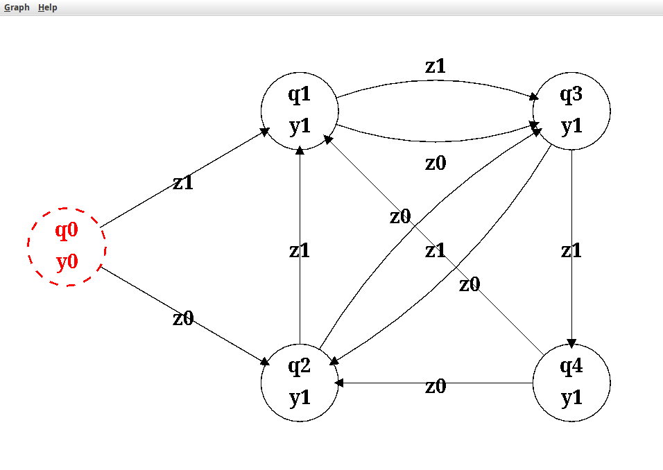

# Moore Machine Graph editor

Application for editing and graphical visualization of Moore Machine Graphs.  
Written in Java using Swing toolkit.



## Compile

```bash
javac -d bin src/moore_machine/*.java
```

## Run

```bash
java -cp bin moore_machine.GraphEditor
```
